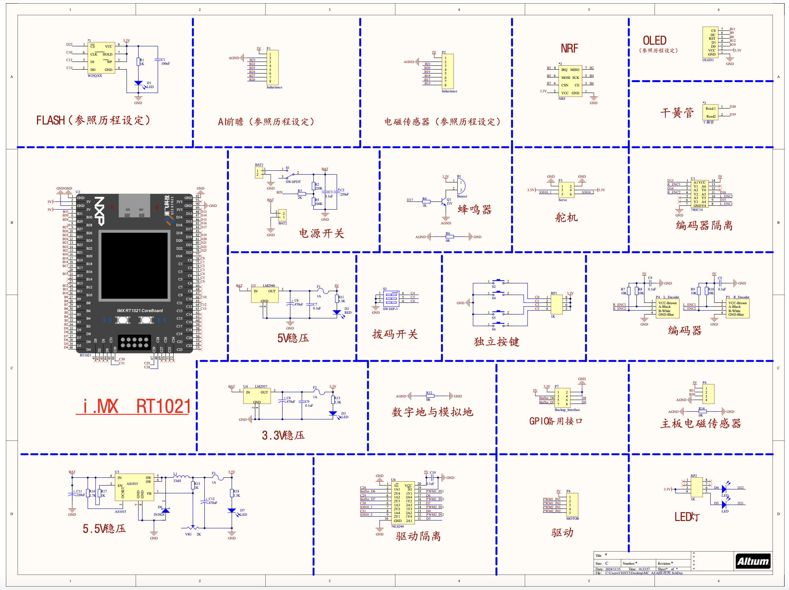
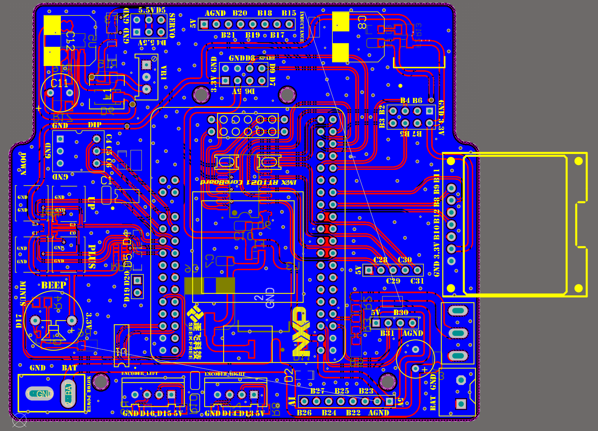

# Smart-Vehicle-Main-Panel

## INTRODUCTION
This is the main control panel designed for the AI group of the National College Student Smart Vehicle Competition. The main control panel uses the i.MX RT1021 chip for control and is equipped with a FLASH module, an encoder isolation module, a motor driver isolation module, and a power management module. It also features reserved interfaces for future upgrades.

## SCHEMATIC

## PCB
